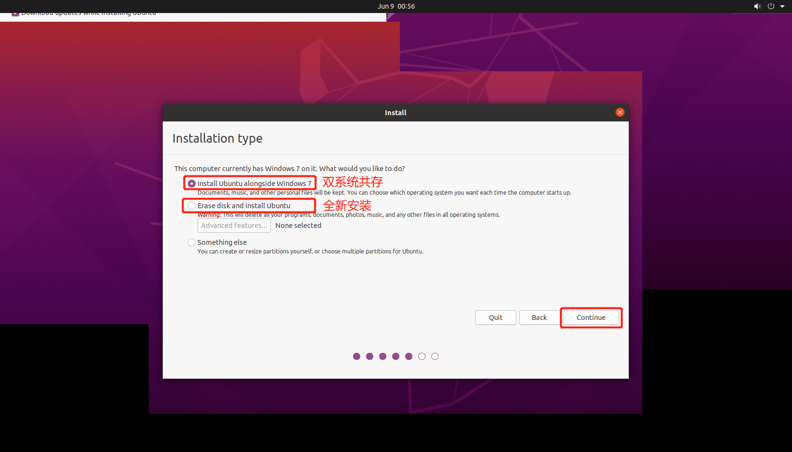

# Ubuntu 安装  

## 禁用Security Boot 选项  

***因为网络上说，如果不关闭`Security Boot` 功能，在安装过程中可能会出异常***

1. 启动机器时按`Enter`中断正常启动  


2. 按`F1` 进入BIOS 设置  


3. 进入`Security Boot` 选项  
  

4. 关闭`Security Boot`  
  

5. 按`F10` 保存设置，并关机。  

## 安装Ubuntu 系统  

1. 插入启动U 盘、开机按`Enter`，然后再按`F12` 选择启动项，选择`从U 盘启动`  
  

2. 耐心等待，选择`安装Ubuntu`，继续  
  

3. 设置键盘布局，继续  
  

4. 是否保留原操作系统，这里选择`清除磁盘并安装`，继续  
  
  4.1. 【注意】若选择`与Windows 系统共存`，则需要进一步设置磁盘选项  
    

5. 选择正常安装，继续  
  

6. 选择时区，继续  
  

7. 设置默认用户（管理员），继续  
  

8. 如果选择了`与Windows 系统共存`，则开机后需要选择系统进入  
  8.1. 选择系统  
   
  8.2. 在Windows 下看到分区信息  
   


## 安装Teamview  

1. 打开`FireFox`，下载安装包  
  <https://download.teamviewer.com/download/linux/teamviewer_amd64.deb>  
2. 按`Ctrl + Alt + T`，打开`Terminal`，按顺序输入：  

```bash
# # 后面的是注释，不用输入

# 1. 切换到下载目录
cd ~/Downloads  # 回车

# 2. 安装下载好的安装包
sudo dpkg -i teamviewer_*.deb  # 回车
# 这一步需要输入密码，需要注意的是，再输入密码时不会显示******
# 输入完密码按回车即可

# 3. 第2. 步最后会提示缺少依赖项，输入以下指令修复即可  
sudo apt-get install -f  # 回车

# 4. 然后重复第2. 步  
sudo dpkg -i teamviewer_*.deb  # 回车

# 5. 启动teamviewer  
teamviewer  # 回车

```
